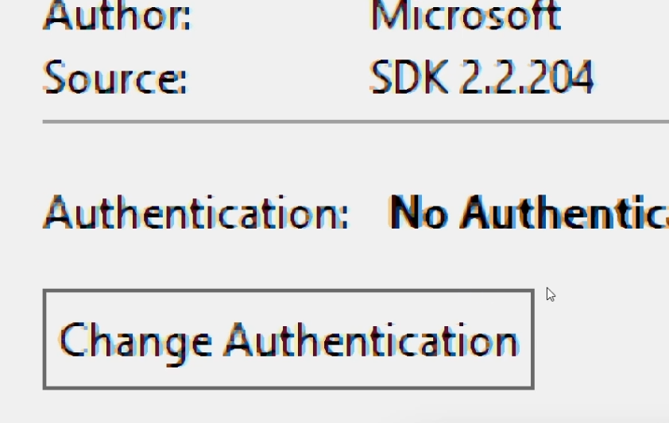

# Sistema de Empresa

Sistema de empresa com tela de login, dashbord dos funcionários e formulário de adição de novos funcionários.

## Parte 0 - Instalação e Versões

A versão mais estável atualmente é a **.NET Core 5.0 SDK**, é tudo que precisa instalar para começar a desenvolver de fato.

### Tipos de Projetos

- Para criar uma versão web:
  - Selecionar o `ASP.NET Core Web Application.`
  - Usar o .Net Core e a versão escolhida.
  - Este projeto utiliza o `Web Application (Model-View-Controller)` com uma autenticação (Utiliza o Identity).
  
## Parte 1 - Entity Framework

### O que é

É uma framework que permite trabalhar com banco de dados sem a necessidade de classes DAO ou lidar diretamente com códigos SQL. 

### Configurando

##### Para criar um DB:

Vai no SQL server explorer e adiciona um banco de dados no localdb. Podemos criar a tabela da forma SQL criando primeiro a tabela e depois o código ou primeiro o código que vai gerar a tabela.

##### Para instalar o Entity:

Instala o pacote `Microsoft.EntityFrameworkCore.SqlServer` pelo NuGet

##### Modificações:

Criamos uma classe que herda **DbContext** e tem o **nome da aplicaçãoContext**:
  - Na classe cria propriedades que retornam `DbSet<Objeto>` com o nome que queremos para a tabela.
  - A classe que herda **DbContext** deve implementar também o override de `OnConfiguring`

Após configurada, podemos salvar, deletar, atualizar objetos usando o Entity com os seguintes comandos:
  ```cs
    using (contexto = new LojaContext()){ //LojaContext é o banco de dados
      contexto.Produtos.Add(produto)  //Produtos é o nome da tabela
      IList<Produto> produtos = coontexto.Produtos.ToList(); //Retorna a lista de itens salvos na tabela Produtos
      contexto.Produtos.Remover(produto); //remove o produto do banco
      contexto.Produtos.Update(produto); //atualiza um produto do banco
      
      contexto.SaveChanges(); //precisamos salvar as mudanças após cada mudança para ela persistir no banco
    }
  ```
  
## Parte 3 - Identity

### O que é

O identity é um framework que facilita a autenticação e login de usuários no sistema. Funciona com todas as tecnologias do ASP.NET Core

- tem integração com o banco de dados SQLite.

- o ideal é implementar essa Framework desde o começo -> ao criar o projeto mudamos a autenticação do projeto.



- caso já esteja criado, deve clicar no projeto com o botão direito -> add -> new Scaffold Item
  - ao adicionar um Scaffold, devemos colocar ele na view `_Layout.cshtml`.

### Login externo

Permite fazer login na apliicação com um provedor externo, tipo google ou facebook.
- Ir no site da Microsoft adicionar um aplicativo.
- Gerar uma senha para o aplicativo e configurar o tipo de plataforma dele e Url de redirecionamento.

### SQlite

O Identity usa o SQlite, para isso, é preciso instalar ele no projeto com o NuGet, e então fazer uma migration do banco para a versão que utiliza o SQlite, da seguinte forma:
  - Adicionamos uma Migration especificando como context o do Identity: `Add-Migration "Identity"  -Context AppIdentityContext`.
  - Aplicamos a migração para criar o banco `Update-Database -Context AppIdentityContext`.
  
### Configurando

##### Para alterar o idioma e conteúdo e das mensagens e dos erros:

- Altera nos arquivos `_LoginPartial.cshtml`, `Login.cshtml` e `Logout.cshtml` para mudar as mensagens da view.

- Altera o arquivo `IdentityHostingStartup.cs` para mudar as mensagens de erro:
  - Adiciona em services uma classe descritora de erros `.AddErrorDescriber<IdentityErrorDescriberPtBr>()` e cria essa classe `IdentityErrorDescriberPtBr` herdando `IdentityErrorDescriber` dando override em todos os métodos. Ex:
    ```cs
      public override IdentityError PasswordRequiresLower()
      {
        return new IdentityError
        {
          Code = nameof(PasswordRequiresLower),
          Description = "A senha deve ter pelo menos um caracter minúsculo."
        };
      }
    ```
  - Para eliminar determinadas características da senha, no `AddDefaultIdentity()` deve-se mudar as options, colocando `AddDefaultIdentity(options =>{})` e definindo como false os atributos `options.Password.`

##### Para alterar as características do banco SQLite:

- Deve adicionar propriedades à classe existente `AppIdentityUser` e depois criar uma migração e aplicar ela para atualizar a tabela de usuário. Ex:
  ```cs
  public class AppIdentityUser : IdentityUser
  {
      public string PropriedadeCustom { get; set; }
  }
  ```
